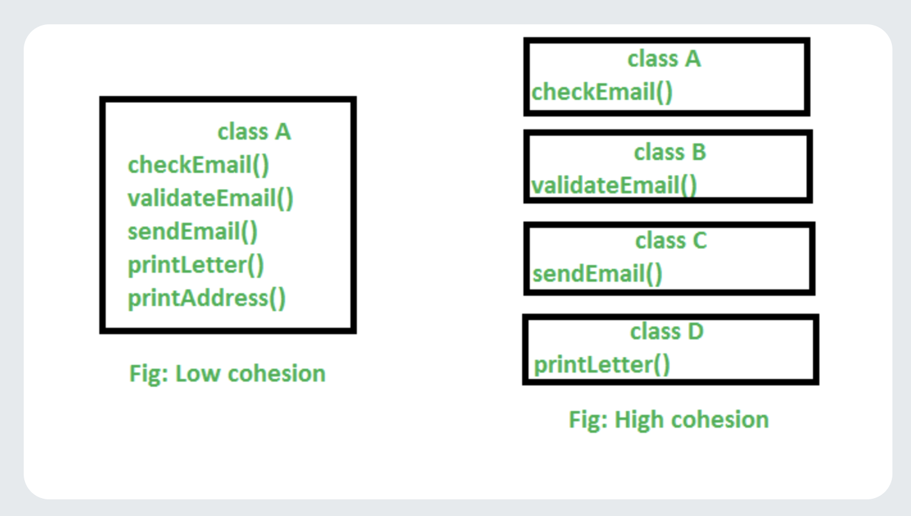

**Coupling** (measurement of dependency)

The degree of dependency between the components is called coupling, If dependency is more then it is considered as tightly coupling and if dependency is less then it is considered as loosely coupling.


```java


class A {
    static int i = B.j
}

class B {
    static int j = C.k;
}

class C {
    static int k = D.m1();
}

class D {
    public static int m1(){
        return 20;
    }
}
```

The above components are said to be tightly coupled with each other as dependency between components is more tightly coupling is not a good programming practice because it has several serious disadvantages. 


Without affecting remaining components we cannt modify any component and hence enhancement will become difficult. It supresses reusablity It reduces maintainblity of the application.

hence we have to maintain dependency between component as less as possible ie loosely coupling is good programming practice.


**Cohesion**

For every component a clear well defined functionality is defined then the component is said to be follow high cohesion. 





high cohesion is always a good programming practice because it has several advantages 

1. without affecting remaining components we can modify any component hence enhacement will become easy.

2. It promotes reusablity of the code whever validation is required we can resuse the same validate servlet without rewriting. it improves maintainablity of the application.


Loosely coupling and high cohesion are good programming practices.