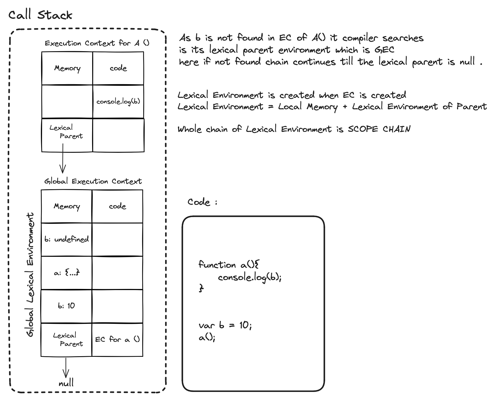

Everything in javascript happens inside an execution context

Javascript is weakly typed, synchronous single threaded language


==Execution Context==  has two components

|Memory | Code|
|----|---|
|key : value| - code execution
|a : 10| - code execution
|fn : {....}| - code execution


 Memory Component - Variable environment 

code component - thread of execution


What happens when you run Javascript Code ?


Everything in Javascript happens inside an execution context.


```js
var n = 2;
function square (num) {
    var ans = num * num;
    return ans;
}

var square2 = square(2)
var square4 = square(4)
```


When you run the code a execution context is created with memory component and code component. It is created in two phase 

1 Memory creation phase : Javascript will allocate memory to all the variable and functions

| Memory |
|---|
|n : undefined|
|square : {...}|
|square2 : undefined|
|square4 : undefined|


2. Code execution phase : 

Memory| Code execution |
|----|---|
|n : undefined|executing n = 2
|n : 2|
||new execution context created for invoking square function for 2 |


-     execution context for invoking square function for 2 
 
    |Memory| 
    |---|
    |num : undefined|
    |ans : undefined|

    |Code execution|
    |---|
    |executing square(n) where n = 2|

    |Memory| 
    |---|
    |num : 2|
    |ans : undefined|

    |Code execution|
    |---|
    |executing ans = num * num|

    |Memory| 
    |---|
    |num : 2|
    |ans : 4|

    |Code execution|
    |---|
    |return ans which finds ans from current memory <br> and return back to the execution context where it is invoked|

| Memory | Code |
|----| ---- |
|n : 2||
|square : {...}|
|square2 : 4 - entire execution context for function invocation will be deleted|
||new execution context created for invoking square function for 4|


-     execution context for invoking square function for 4
 
    |Memory| 
    |---|
    |num : undefined|
    |ans : undefined|

    |Code execution|
    |---|
    |executing square(n) where n = 4|

    |Memory| 
    |---|
    |num : 4|
    |ans : undefined|

    |Code execution|
    |---|
    |executing ans = num * num|

    |Memory| 
    |---|
    |num : 2|
    |ans : 16|

    |Code execution|
    |---|
    |return ans which finds ans from current memory <br> and return back to the execution context where it is invoked|

| Memory | Code |
|----| ---- |
|n : 2||
|square : {...}|
|square2 : 4 - entire execution context for function invocation will be deleted|
|square4 : 16 - entire execution context for function invocation will be deleted|


JS Engine handles everything to manage everything this creation and deletion of execution context through call stack

|Call stack|
|---|
|Execution Context for 2|
|Global Execution Context|


|Call stack|
|---|
|Execution Context for 4|
|Global Execution Context|


When execution context is created it will be pushed into the stack and when it is completed it will be deleted from the stack. After the whole program is executed the call stack becomes empty.


Call Stack maintains the order of execution of execution contexts


Call stack is also known by 

0. Call stack
1. Execution Context Stack
2. Program Stack
3. Control Stack
4. Runtime Stack
5. Machine stack


Hoisting in Javascript : Hoisting is JavaScript's default behavior of moving declarations to the top.

```js
var x = 7;

function getName(){
    console.log("Namaste Javascript");
}

getName();
console.log(x);

```

```
Namaste Javascript
7
```

```js
var x = 7;

getName();
console.log(x);

function getName(){
    console.log("Namaste Javascript");
}
```

```
Namaste Javascript
undefined
```

```js

getName();
console.log(x);

function getName(){
    console.log("Namaste Javascript");
}
```

```
Namaste Javascript
Uncaught ReferenceError: x is not defined at index.js:3
```


```js

console.log(getName);

function getName(){
    console.log("Namaste Javascript");
}
```

```
f getName(){
    console.log("Namaste Javascript");
}
```


```js

var getName1 = () => {
    console.log("Namaste Javascript")
}

var getName2 = function(){
    console.log("Namaste Javascript")
}


// getName will behave like a variable and will be initialized with undefined

```


**Functions in Javascript**

```js

var x = 1;

a();
b();

console.log(x)

function a (){
    var x = 10;
    console.log(x);
}

function b (){
    var x = 100;
    console.log(x)
}

```


```
10
100
1

```


|Memory| Code|
|-|-|
|x : undefined||
|a : {...} |
|b : {...} |
||x = 10;
|x: 10|
||new execution context created for invoking a ( )|

- Execution Context for a ( )

    |Memory|Code|
    |-|-|
    |x : undefined||
    ||x=10|
    |x : 10|
    ||console.log(x)|

|Memory| Code|
|-|-|
|x : undefined||
|a : {...} |
|b : {...} |
||x = 10;
|x: 10|
||new execution context create for invoking b ( ) |


- Execution Context for b ( )

    |Memory|Code|
    |-|-|
    |x : undefined||
    ||x=100|
    |x : 100|
    ||console.log(x)|

|Memory| Code|
|-|-|
|x : undefined||
|a : {...} |
|b : {...} |
||x = 1;
|x: 1|
||console.log(1)|

Global Execution Context deleted


**Shortest Javascript Program**


index.js 
```js


```


windown - is global object which is created with gec along with gec this is created.


this === window > true in global execution context 


so does that mean this and window is same ?

this and window are not the same thing. Depending on context, this can refer to any number of elements, while window always means window.


```js
var a = 10;

console.log(window.a);
console.log(a);
console.log(this.a);

```

**undefined and not defined**

> var a = undefined (fine but not a good practice)


**The scope chain, Scope and Lexical Environment**

Lexical Environment is created when EC is created
Lexical Environment = Local Memory + Lexical Environment of Parent

Whole chain of Lexical Environment is SCOPE CHAIN




```js
function a(){
    c();

    function c(){
        console.log(b)
    }
}


var b = 10;
a();

```


**let and const in JS**


let and const are hoisted. 

```js
console.log(a)
let a = 10
var b = 100
```
```
Uncaught ReferenceError: cannot access 'a' before initialization at index.js:1
```


Memory is assigned to var declaration and this var was attached to the global object but for let and const they are stored in separate memory space than global and you cannot access then unless let and const variables are initialized.


Temporal dead zone is time from when let variable was hoisted and when it was initialized.

```js
console.log(x)

let a = 10
var b = 100
```
```
Uncaught ReferenceError: x is not defined index.js:1
```


```js
console.log(x)

let a = 10
let a  = 100
```
```
Uncaught SyntaxError : Identified 'a' has already been declared
```


```js
console.log(x)

let a = 10
var a  = 100
```
```
Uncaught SyntaxError : Identified 'a' has already been declared
```


In let you can initialize after but in const you have to initialize it while declaring.
In let you cannot re-declare and in const you cannot re-initialize it


```js

let a;

const b;

b = 1000;

a= 10;
console.log(a);
```


```
Uncaught SyntaxError: Missing Initializer in const declaration
```

```js

let a;

const b = 100;

b = 1000;
```
```
Uncaught TypeError: Assignment to constant variable at index.js:6
```

How to avoid temporal deadzone ?

Initialize at top


**Block Scope and Shadowing in JS**


Block is defined by curly braces. Block is also known as compound statement. We group multiple statements in a block where js expects one one statment.


Block Scope : what all variable and function we can access inside this block.

```
{

    var a = 10;
    let b = 20;
    const c = 30;

}

```

let and const are block scoped


```js

var a = 100


{
    var a = 10;

    console.log(a);
}

console.log(a)

```
```
10
10
```


a was shadowed and the value was also modified


```js

let b = 100


{
    let b = 10;

    console.log(b);
}

console.log(b)

```
```
10
100
```


**Illegal shadowing**
```js

let a = 20;

{
    var a = 100; // crossing the boundary of block and going to global
}

```


Perfectly valid shadowing


```js

var a = 20;

{
    let a = 100;
}

```


```js

var a = 20;

function x(){
    let a = 100;
}

```


**Closures**

```js

function x(){
    var a = 7;
    function y(){
        console.log(a);
    }
    y()
}
x()
```

Function along with its lexical scope forms a closure


A closure is function bundled together to its lexical state.


```js

function x(){
    var a = 7;
    function y(){
        console.log(a);
    }
    return y;
}

var z = x();
console.log(z);

```
```
f y(){
    console.log(a);
}
```

now x() execution context is gone, nothing is there what will z() print


Z will rememeber its lexical scope as not only the funtion was returned but clousure was returned.


```js
function x(){
    var a = 7;

    return function y(){
        console.log(a);
    }
}

var z = x ();
console.log(z);

z();
```
>7


```js
function x(){
    var a = 7;
    function y(){
        console.log(a);
    }
    a = 1000
    return y;
}

var z = x();
z();
```

> 1000


```js


function z (){
    var b = 990;
    function x(){
        var a = 7;
        function y(){
            console.log(a, b);
        }
        y();
    }
    x();
}
z();
```


Where are clousure used ?

- Module design pattern
- currying in Js
- functions like once
- memoize
- maintaining state in async world
- setTimeouts
- Iterators
- and many more


**setTimeout + Closures Interview Questions**
```js
// Javascript waits for none

function x(){
    var i = 1;
    setTimeout(fucntion(){ //program does not wait it will work on next line
        console.log(i);
    }, 1000);

    console.log("Namaste Javascript")
}


```

setTimeout puts the reference of the function with the timer and once the timer expires it takes that reference with closure, puts it in call stack again and executes it.

```js

// Print 1 to n after 1 seconds


for (var i =1 ; i<=5 ; i++){
    setTimeout(function(){
        console.log(i)
    }, i*1000);
}

```

```
6
6
6
6
6
```


setTimeout remembers reference to i but not value of i hence i will be pointing to same reference of i where i is 6 after execution of the code. Javascript waits for none and it will store the reference and when the timer expires it is too late and i is now 6 and by the time we log - we will log 6 which is i refererring to 6

```js

// Fixing above code Print 1 to n after 1 seconds


for (let i =1 ; i<=5 ; i++){
    setTimeout(function(){
        console.log(i)
    }, i*1000);
}

```

```
1
2
3
4
5
```

let has block scope so for each iteration i is a new variable and with each iteration i has its own copy with it.


```js

// Fixing above code without let Print 1 to n after 1 seconds


for (var i =1 ; i<=5 ; i++){

    function close(x){
        setTimeout(function(){
            console.log(x)
        }, x*1000);
    }
    close(i)
   
}

```

```
1
2
3
4
5
```

**Interviews**

Can you explain what closure is and give an example for clousure ?


Data hiding and encapsulation 


```js
function counter (){
    var count  = 0 

    return function incrementCounter(){
        count++;
        console.log(count)
    }

}


var counter1 = counter()

counter1();
counter1();


var counter2 = counter() // new instance
counter2();
counter2();
```


Constructor


```js
function Counter (){
    var count  = 0 

    this.incrementCounter(){
        count++;
        console.log(count)
    }

    this.decrementCounter(){
        count--;
        console.log(count)
    }
}

var counter1 = new Counter();

counter1.increamentCounter();
counter1.increamentCounter();
counter1.decrementCounter();

```


Disadvantages of closure


Over consumption of memory

Not garbage collected

Freeze browser


Garbage collector in JS whenever there is unused variable it removes these variable. relation between garbage collector and closure - 


```js

function a (){
    var x = 0
    return function b (){
        console.log(x);
    }
}
```

var y = a();


x memory cannot be freed unless y is used, some modern browser have check if variable is not reached and unused then they are smartly removed from memory


**First Class functions**

What is anonymous functions ?

What are first class functions in Javascript ?

What is difference between fucntion statement, function expression, function declaration ?


**Function statement = Function Declaration**


```js

function a(){

    console.log("a called");

}

// This way of creating function is called function statement

```


**Function Expression**

Function can be assigned to a variable 

```js

var b = function (){
    console.log("b called")
}

```

Different between function statement and function expression
- Major difference is hoisting - During the memory creation phase function a is allocated memory and function is assigned to memory, In case of b it is treated like variable and assigned the value undefined untill the code execution phase


**Anonymous Function**

```js
function(){

}

```

According to ECMA Script a function name should always have a name otherwise it will throw


Uncaught SyntaxError : Function index.js:15 statements require a function name

But Anonymous functions can be used as variables.


**Named Function Expression**

```js

var b = function xyz (){
    console.log("b called")
}

b() // b called
xyz() // Uncaught ReferenceError : xyz is not defined

```

xyz is not function created in outerscope but created as local variable


```js

var b = function xyz (){
    console.log(xyz)
}
```


Difference between parameter and Arguments ?


```js

var b = function (param1, param2){
    
}

b(arg1, arg2)

```


**First class functions = First class citizens**

Ability to be used as values

The ability of functions to be used as values and can be passed as arguments to another functions and to be returned from functions this ability is first class functions


```js

var b = function (param1, param2){

    return param1 // returning function
    
}

arg1 = function(){
    console.log("arg1")
}


arg2 = function(){
    console.log("arg2")
}


b(arg1, arg2) // passing functions are argument

```


**Arrow Functions**


**Callback Functions**

// Blocking the main thread

```js
function x(){
    console.log("x is called");
    y();
}

x(function y(){
    console.log("y is called");
})
```

A callback function is a function passed into another function as an argument, which is then invoked inside the outer function to complete some kind of routine or action.


Javascript is synchronous and single threaded language

Blocking the main thread

power of callbacks


// Event Listeners


> document.getElementById("clickMe").addEventListner("click", function xyz(){console.log("clicked")})


EventListner and closures

```js

function attachEventListeners(){
    let count = 0;
    document.getElementById("clickMe").addEventListener("click", console.log("Button Clicked", ++count));
};

attachEventListeners();
```

Garbage Collection and Event Listener


EventListeners are heavy, When page has lot of eventlisteners the page can be slow due to all these closures, scopes. It can be garbage collected with removeEventListeners


** Asynchronous Javascript and EventLoop**

It has one callstack and it can only do one thing

All code is executed inside this callstack

Recapping GEC is created while running a program and it is put inside the callstack

setTimeout is not part of Javascript


setTimeout, DOM APIs - document.etc , fetch(), localStorage, console from console.log, location is not part of Javascript they are Web API's in browsers. They are powers from browsers


**Higher Order functions**


Function which can take another function as an argument or return function as value they are called higher order functions


```js

const radius = [3, 1, 2, 4]

const calculateArea = function (radius){
    const output = []
    for (let i = 0 ; i < radius.length ; i++){
        output.push(Math.PI * radius[i] * radius[i])
    }

    return output
}


const calculateCircumference = function (radius){
    const output = []
    for (let i = 0 ; i < radius.length ; i++){
        output.push(2 * Math.PI * radius[i] )
    }

    return output
}

const calculateDiameter = function (radius){
    const output = []
    for (let i = 0 ; i < radius.length ; i++){
        output.push(2 * radius[i] )
    }

    return output
}

```

```js
const radius = [3, 1, 2, 4]


const area = function (radius){
    return Math.PI * radius  * radius
}


const circumference = function (radius){
    return 2 * Math.PI * radius
}

const diameter = function (radius){
    return 2 * radius
}
 
const calculate = function (radius, logic){
    const output = []
    for ( let  i = 0;  i < radius.length ; i++){
        output.push(logic(radius[i]))
    }
    return output
}

```


Functions are very beautiful in javascipt


Time tide and javascripts waits for none
