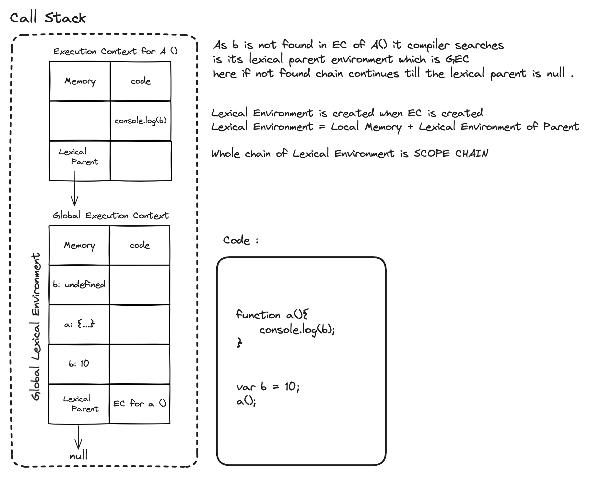
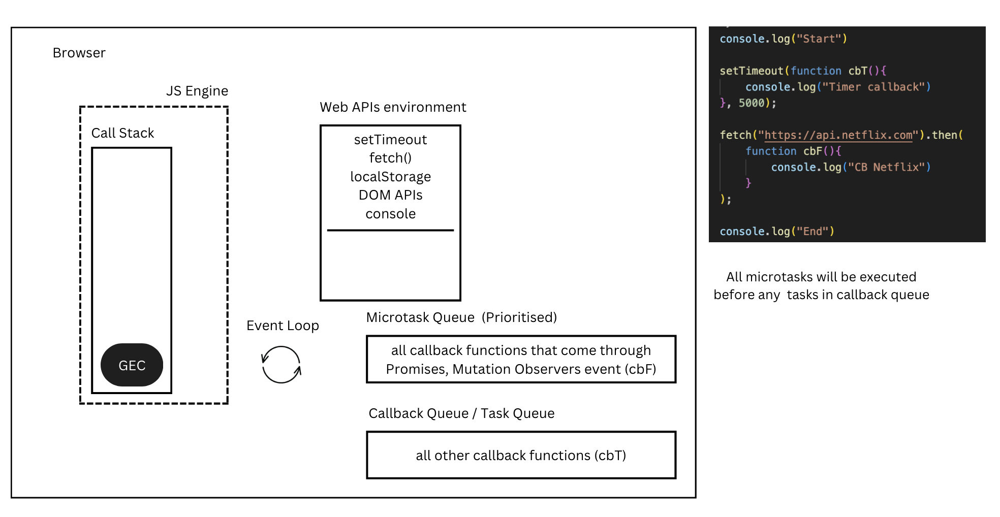
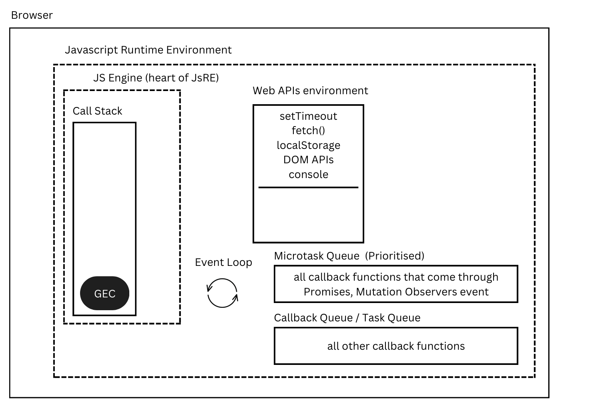
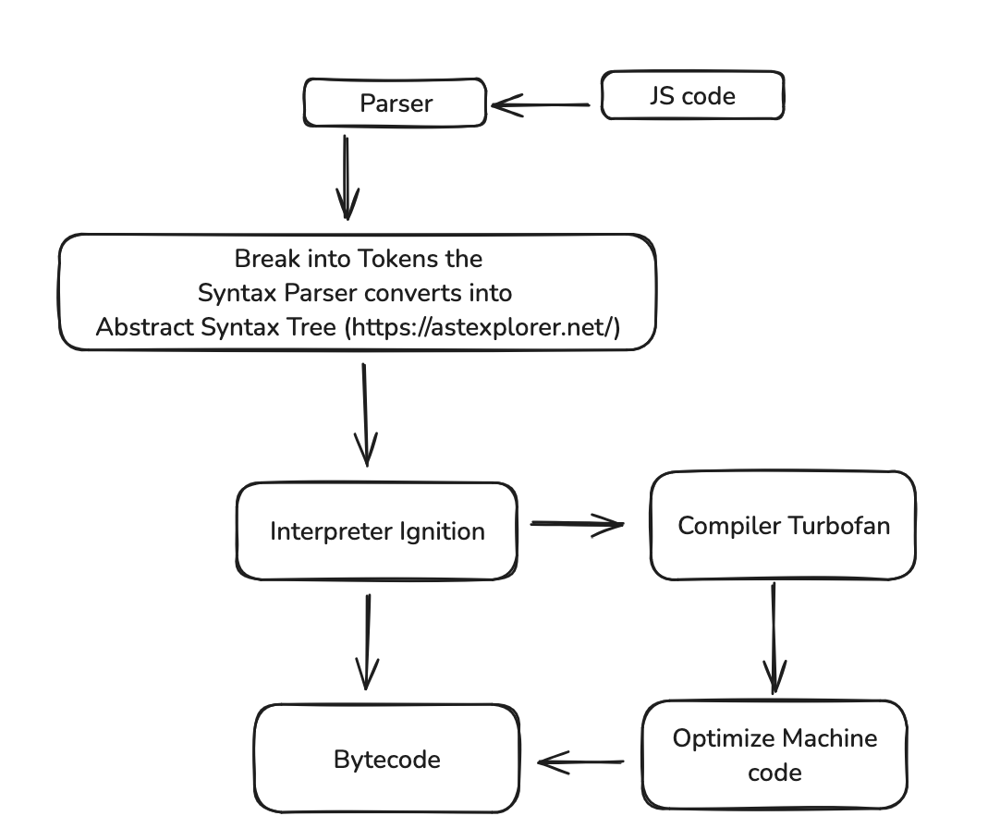

JavaScript is a weakly-typed synchronous single-threaded language.

- Weakly typed language : JavaScript is a weakly typed language. It recognizes different data types (numbers, strings, etc.), but doesn't use them too strictly, trying to convert data when it seems reasonable
- Synchronous: It executes one command at a time in a specific order.
- Single-threaded: It can only execute one command at a time. It proceeds to the next line only when the current line has finished executing.


Everything in javascript happens inside an execution context. The execution context is like a big box or container where the JavaScript code is executed.

_Execution Context_ has two components

|Memory Component | Code Component|
|----|---|
|a : undefined|
|| code execution a = 10
|a : 10| 
|fn : {.....}| 


Memory Component also known as Variable environment. Variables and functions are stored in the memory component as key-value pairs.

Code Component also known as Thread of Execution. The code component is where the JavaScript code is executed line by line.


**Question** : What happens when you run Javascript Code ?

As mentioned above everything in Javascript happens inside an execution context. When you run the code, an execution context is created with memory component and code component. Let's consider Javascript code below


```js
var n = 2;
function square (num) {
    var ans = num * num;
    return ans;
}

var square2 = square(2)
var square4 = square(4)
```

The execution happens as follows : 

1 Memory creation phase : Javascript will allocate memory to all the variable and functions

| Memory |
|---|
|n : undefined|
|square : {...}|
|square2 : undefined|
|square4 : undefined|


2. Code execution phase : 

Memory| Code execution |
|----|---|
|n : undefined|executing n = 2
|n : 2|
||new execution context created for invoking square function for 2 |


-     execution context for invoking square function for 2 
 
    |Memory| 
    |---|
    |num : undefined|
    |ans : undefined|

    |Code execution|
    |---|
    |executing square(n) where n = 2|

    |Memory| 
    |---|
    |num : 2|
    |ans : undefined|

    |Code execution|
    |---|
    |executing ans = num * num|

    |Memory| 
    |---|
    |num : 2|
    |ans : 4|

    |Code execution|
    |---|
    |return ans which finds ans from current memory <br> and return back to the execution context where it is invoked|

| Memory | Code |
|----| ---- |
|n : 2||
|square : {...}|
|square2 : 4 - entire execution context for function invocation will be deleted|
||new execution context created for invoking square function for 4|


-     execution context for invoking square function for 4
 
    |Memory| 
    |---|
    |num : undefined|
    |ans : undefined|

    |Code execution|
    |---|
    |executing square(n) where n = 4|

    |Memory| 
    |---|
    |num : 4|
    |ans : undefined| 

    |Code execution|
    |---|
    |executing ans = num * num|

    |Memory| 
    |---|
    |num : 2| 
    |ans : 16|

    |Code execution|
    |---|
    |return ans which finds ans from current memory <br> and return back to the execution context where it is invoked|

| Memory | Code |
|----| ---- | 
|n : 2||
|square : {...}|
|square2 : 4 - entire execution context for function invocation will be deleted|
|square4 : 16 - entire execution context for function invocation will be deleted|


JS Engine handles everything to manage everything this creation and deletion of execution context through call stack

|Call stack|
|---|
|Execution Context for square(2)|
|Global Execution Context|


|Call stack|
|---|
|Execution Context for square(4)|
|Global Execution Context|

return statements return control to the invoking context. Return values are stored in memory if they have to be  stored in variable.

When execution context is created it will be pushed into the stack, each execution context has its own memory component and code component and when it is completed it will be deleted from the stack. After the whole program is executed the call stack becomes empty.

Callstack maintains the order of execution of execution contexts. The topmost execution context is the one currently being executed. The bottom execution context is the Global Execution Context and others are Function EC.


Callstack is also known by 

0. Callstack
1. Execution Context Stack
2. Program Stack
3. Control Stack
4. Runtime Stack
5. Machine stack


**Question** : What is Hoisting in Javascript ?

Hoisting is JavaScript's default behavior of moving declarations to top of their scope, prior to execution of the code. 


Hoisting Code Snippet 1 :
```js
var x = 7;

function getName(){
    console.log("Namaste Javascript");
}

getName();
console.log(x);

```
Output : 
```
Namaste Javascript
7
```

Hoisting Code Snippet 2 :

```js
var x = 7;

getName();
console.log(x);

function getName(){
    console.log("Namaste Javascript");
}
```
Output : 

```
Namaste Javascript
undefined
```

Hoisting Code Snippet 3 :

```js

getName();
console.log(x);

function getName(){
    console.log("Namaste Javascript");
}
```
Output : 
```
Namaste Javascript
Uncaught ReferenceError: x is not defined at index.js:3
```

Hoisting Code Snippet 4 :
```js

console.log(getName);

function getName(){
    console.log("Namaste Javascript");
}
```
Output : 
```
f getName(){
    console.log("Namaste Javascript");
}
```

Hoisting Code Snippet 5 :

```js

var getName1 = () => {
    console.log("Namaste Javascript")
}

var getName2 = function(){
    console.log("Namaste Javascript")
}


// getName will behave like a variable and will be initialized with undefined

```


**Functions in Javascript**


Functions Code Snippet 1 : 

```js

var x = 1;

a();
b();

console.log(x)

function a (){
    var x = 10;
    console.log(x);
}

function b (){
    var x = 100;
    console.log(x)
}

```

Output : 

```
10
100
1

```


|Memory| Code|
|-|-|
|x : undefined||
|a : {...} |
|b : {...} |
||x = 10;
|x: 10|
||new execution context created for invoking a ( )|

- Execution Context for a ( )

    |Memory|Code|
    |-|-|
    |x : undefined||
    ||x=10|
    |x : 10|
    ||console.log(x)|

|Memory| Code|
|-|-|
|x : undefined||
|a : {...} |
|b : {...} |
||x = 10;
|x: 10|
||new execution context create for invoking b ( ) |


- Execution Context for b ( )

    |Memory|Code|
    |-|-|
    |x : undefined||
    ||x=100|
    |x : 100|
    ||console.log(x)|

|Memory| Code|
|-|-|
|x : undefined||
|a : {...} |
|b : {...} |
||x = 1;
|x: 1|
||console.log(1)|

Global Execution Context deleted


**Shortest Javascript Program**


Empty JS File is the shortest Javascript Program

index.js 
```js


```


windown - is global object which is created with gec along with gec this is created.


this === window > true in global execution context 


so does that mean this and window is same ?

this and window are not the same thing. Depending on context, this can refer to any number of elements, while window always means window.


```js
var a = 10;

console.log(window.a);
console.log(a);
console.log(this.a);

```

**undefined and not defined**

> var a = undefined (fine but not a good practice)


**The scope chain, Scope and Lexical Environment**

Lexical Environment is created when EC is created
Lexical Environment = Local Memory + Lexical Environment of Parent

Whole chain of Lexical Environment is SCOPE CHAIN




```js
function a(){
    c();

    function c(){
        console.log(b)
    }
}


var b = 10;
a();

```


**let and const in JS**


let and const are hoisted. 

```js
console.log(a)
let a = 10
var b = 100
```
```
Uncaught ReferenceError: cannot access 'a' before initialization at index.js:1
```


Memory is assigned to var declaration and this var was attached to the global object but for let and const they are stored in separate memory space than global and you cannot access then unless let and const variables are initialized.


Temporal dead zone is time from when let variable was hoisted and when it was initialized.

```js
console.log(x)

let a = 10
var b = 100
```
```
Uncaught ReferenceError: x is not defined index.js:1
```


```js
console.log(x)

let a = 10
let a  = 100
```
```
Uncaught SyntaxError : Identified 'a' has already been declared
```


```js
console.log(x)

let a = 10
var a  = 100
```
```
Uncaught SyntaxError : Identified 'a' has already been declared
```


In let you can initialize after but in const you have to initialize it while declaring.
In let you cannot re-declare and in const you cannot re-initialize it


```js

let a;

const b;

b = 1000;

a= 10;
console.log(a);
```


```
Uncaught SyntaxError: Missing Initializer in const declaration
```

```js

let a;

const b = 100;

b = 1000;
```
```
Uncaught TypeError: Assignment to constant variable at index.js:6
```

How to avoid temporal deadzone ?

>Initialize at top


**Block Scope and Shadowing in JS**


Block is defined by curly braces. Block is also known as compound statement. We group multiple statements in a block where js expects one one statment.


Block Scope : what all variable and function we can access inside this block.

```
{

    var a = 10;
    let b = 20;
    const c = 30;

}

```

let and const are block scoped


```js

var a = 100


{
    var a = 10;

    console.log(a);
}

console.log(a)

```
```
10
10
```


a was shadowed and the value was also modified


```js

let b = 100


{
    let b = 10;

    console.log(b);
}

console.log(b)

```
```
10
100
```


**Illegal shadowing**
```js

let a = 20;

{
    var a = 100; // crossing the boundary of block and going to global
}

```


Perfectly valid shadowing


```js

var a = 20;

{
    let a = 100;
}

```


```js

var a = 20;

function x(){
    let a = 100;
}

```


**Closures**

```js

function x(){
    var a = 7;
    function y(){
        console.log(a);
    }
    y()
}
x()
```

Function along with its lexical scope forms a closure


A closure is function bundled together to its lexical state.


```js

function x(){
    var a = 7;
    function y(){
        console.log(a);
    }
    return y;
}

var z = x();
console.log(z);

```
```
f y(){
    console.log(a);
}
```

now x( ) execution context is gone, nothing is there what will z( ) print


Z will rememeber its lexical scope as not only the funtion was returned but closure was returned.


```js
function x(){
    var a = 7;

    return function y(){
        console.log(a);
    }
}

var z = x ();
console.log(z);

z();
```
>7


```js
function x(){
    var a = 7;
    function y(){
        console.log(a);
    }
    a = 1000
    return y;
}

var z = x();
z();
```

> 1000


```js


function z (){
    var b = 990;
    function x(){
        var a = 7;
        function y(){
            console.log(a, b);
        }
        y();
    }
    x();
}
z();
```


Where are closure used ?

- Module design pattern
- currying in Js
- functions like once
- memoize
- maintaining state in async world
- setTimeouts
- Iterators
- and many more


**setTimeout + Closures Interview Questions**
```js
// Javascript waits for none

function x(){
    var i = 1;
    setTimeout(function(){ //program does not wait it will work on next line
        console.log(i);
    }, 1000);

    console.log("Namaste Javascript")
}


```

setTimeout puts the reference of the function with the timer and once the timer expires it takes that reference with closure, puts it in call stack again and executes it.

```js

// Print 1 to n after 1 seconds


for (var i =1 ; i<=5 ; i++){
    setTimeout(function(){
        console.log(i)
    }, i*1000);
}

```

```
6
6
6
6
6
```


setTimeout remembers reference to i but not value of i hence i will be pointing to same reference of i where i is 6 after execution of the code. Javascript waits for none and it will store the reference and when the timer expires it is too late and i is now 6 and by the time we log - we will log 6 which is i refererring to 6

```js

// Fixing above code Print 1 to n after 1 seconds


for (let i =1 ; i<=5 ; i++){
    setTimeout(function(){
        console.log(i)
    }, i*1000);
}

```

```
1
2
3
4
5
```

let has block scope so for each iteration i is a new variable and with each iteration i has its own copy with it.


```js

// Fixing above code without let Print 1 to n after 1 seconds


for (var i =1 ; i<=5 ; i++){

    function close(x){
        setTimeout(function(){
            console.log(x)
        }, x*1000);
    }
    close(i)
   
}

```

```
1
2
3
4
5
```

**Interviews**

Can you explain what closure is and give an example for clousure ?


Data hiding and encapsulation 


```js
function counter (){
    var count  = 0 

    return function incrementCounter(){
        count++;
        console.log(count)
    }

}


var counter1 = counter()

counter1();
counter1();


var counter2 = counter() // new instance
counter2();
counter2();
```

Can you make above code scalable ?

Yes we can use Constructor


```js
function Counter (){
    var count  = 0 

    this.incrementCounter(){
        count++;
        console.log(count)
    }

    this.decrementCounter(){
        count--;
        console.log(count)
    }
}

var counter1 = new Counter();

counter1.incrementCounter();
counter1.incrementCounter();
counter1.decrementCounter();

```


Disadvantages of closure :


Over consumption of memory

Not garbage collected

if not handled properly browser freeze


Garbage collector in JS whenever there is unused variable it removes these variable. relation between garbage collector and closure - 


```js

function a (){
    var x = 0
    return function b (){
        console.log(x);
    }
}
```

var y = a( );


x memory cannot be freed unless y is used, some modern browser have check if variable is not reached and unused then they are smartly removed from memory


**First Class functions**

What is anonymous functions ?

What are first class functions in Javascript ?

What is difference between fucntion statement, function expression, function declaration ?


**Function statement = Function Declaration**


```js

function a(){

    console.log("a called");

}

// This way of creating function is called function statement

```


**Function Expression**

Function can be assigned to a variable 

```js

var b = function (){
    console.log("b called")
}

```

Different between function statement and function expression
- Major difference is hoisting - During the memory creation phase function a is allocated memory and function is assigned to memory, In case of b it is treated like variable and assigned the value undefined untill the code execution phase


**Anonymous Function**

```js
function(){

}

```

According to ECMA Script a function name should always have a name otherwise it will throw


Uncaught SyntaxError : Function index.js:15 statements require a function name

But Anonymous functions can be used as variables.


**Named Function Expression**

```js

var b = function xyz (){
    console.log("b called")
}

b() // b called
xyz() // Uncaught ReferenceError : xyz is not defined

```

xyz is not function created in outerscope but created as local variable


```js

var b = function xyz (){
    console.log(xyz)
}
```


Difference between parameter and Arguments ?


```js

var b = function (param1, param2){
    
}

b(arg1, arg2)

```


**First class functions = First class citizens**

Ability to be used as values

The ability of functions to be used as values and can be passed as arguments to another functions and to be returned from functions this ability is first class functions


```js

var b = function (param1, param2){

    return param1 // returning function
    
}

arg1 = function(){
    console.log("arg1")
}


arg2 = function(){
    console.log("arg2")
}


b(arg1, arg2) // passing functions are argument

```


**Arrow Functions**

Learn on yourself


**Callback Functions**

// Blocking the main thread

```js
function x(){
    console.log("x is called");
    y();
}

x(function y(){
    console.log("y is called");
})
```

A callback function is a function passed into another function as an argument, which is then invoked inside the outer function to complete some kind of routine or action.


Javascript is synchronous and single threaded language

Blocking the main thread

power of callbacks


// Event Listeners


> document.getElementById("clickMe").addEventListner("click", function xyz(){console.log("clicked")})


EventListener and closures

```js

function attachEventListeners(){
    let count = 0;
    document.getElementById("clickMe").addEventListener("click", console.log("Button Clicked", ++count));
};

attachEventListeners();
```

Garbage Collection and Event Listener


EventListeners are heavy, When page has lot of eventlisteners the page can be slow due to all these closures, scopes. It can be garbage collected with removeEventListeners


**Asynchronous Javascript and EventLoop**

It has one callstack and it can only do one thing

All code is executed inside this callstack

Recapping GEC is created while running a program and it is put inside the callstack

setTimeout is not part of Javascript


setTimeout, DOM APIs - `document.` etc , fetch(), localStorage, console from console.log, location is not part of Javascript they are Web API's in browsers. They are powers from browsers





**Javascript Exposed**

- Chrome - V8 JS Engine
- Firefox - SpiderMonkey (evolved from first JS Engine)
- Edge - Chakra








Important Topics : 

- Just In Time Compilation
- Mark and Sweep Algorithm
- Inlining
- Copy Elision
- Inline Caching
- Ahead of Time Compilation 
- Garbage Collector (Orinoco)


**setTimeout Trust Issues**


```js
console.log("Start")

setTimeout(function cbT (){
    console.log("callback function executed");
},5000);


console.log("End")


let startDate = new Date().getTime();
let endDate = startDate;

while(endDate < startDate + 10000){
    endDate = new Date().getTime();
}

console.log("10 seconds completed expires")
```

Output : 

```
Start
End
10 seconds completed expires
callback function executed
```


```js


console.log("Start")

setTimeout(function cbT (){
    console.log("callback function executed");
},0);

console.log("End")

```

Output : 
```
Start
End
callback function executed
```

**Higher Order functions**


Function which can take another function as an argument or return function as value they are called higher order functions


```js

const radius = [3, 1, 2, 4]

const calculateArea = function (radius){
    const output = []
    for (let i = 0 ; i < radius.length ; i++){
        output.push(Math.PI * radius[i] * radius[i])
    }

    return output
}


const calculateCircumference = function (radius){
    const output = []
    for (let i = 0 ; i < radius.length ; i++){
        output.push(2 * Math.PI * radius[i] )
    }

    return output
}

const calculateDiameter = function (radius){
    const output = []
    for (let i = 0 ; i < radius.length ; i++){
        output.push(2 * radius[i] )
    }

    return output
}

```

```js
const radius = [3, 1, 2, 4]


const area = function (radius){
    return Math.PI * radius  * radius
}


const circumference = function (radius){
    return 2 * Math.PI * radius
}

const diameter = function (radius){
    return 2 * radius
}
 
const calculate = function (radius, logic){
    const output = []
    for ( let  i = 0;  i < radius.length ; i++){
        output.push(logic(radius[i]))
    }
    return output
}

calculate(radius, area)

```

Polyfill for map

```js

const radius = [3, 1, 2, 4]


const area = function (radius){
    return Math.PI * radius  * radius
}


const circumference = function (radius){
    return 2 * Math.PI * radius
}

const diameter = function (radius){
    return 2 * radius
}
 
Array.prototype.calculate = function (radius, logic){
    const output = []
    for ( let  i = 0;  i < radius.length ; i++){
        output.push(logic(radius[i]))
    }
    return output
}

console.log(radius.calculate(area)) //similar to
console.log(radius.map(area)) 

```

Functions are very beautiful in javascipt


Time tide and javascripts waits for none


**map filter and reduce**


```js
const users = [
    {firstName : "Rahul", lastName : "Kumar", age : 23},
    {firstName : "Rohit", lastName : "Sharma", age : 25},
    {firstName : "Virat", lastName : "Kohli", age : 30},
    {firstName : "Sachin", lastName : "Tendulkar", age : 40},
    {firstName : "Sourav", lastName : "Ganguly", age : 35},
    {firstName : "MS", lastName : "Dhoni", age : 38},
    {firstName : "Yuvraj", lastName : "Singh", age : 35},
    {firstName : "Ravindra", lastName : "Jadeja", age : 33},
    {firstName : "Hardik", lastName : "Pandya", age : 27},
    {firstName : "Jasprit", lastName : "Bumrah", age : 26}
]


function getFullName(user){
    return user.firstName + " " + user.lastName;
}

console.log(users.map(getFullName));


function getAgeGreaterThan25(user){
    return user.age > 25;
}

console.log(users.filter(getAgeGreaterThan25));

function groupByAge(acc, curr){
    if(acc[curr.age]){
        acc[curr.age] = ++acc[curr.age];
    }else{
        acc[curr.age] = 1;
    }
    return acc;
}

console.log(users.reduce(groupByAge, {}));

// Homework - Get name of people who have age less than 30 using reduce

function getAgeLessThan30(acc, curr){
    if(curr.age < 30){
        acc.push(curr.firstName);
    }
    return acc;
}

console.log(users.reduce(getAgeLessThan30, []));

```


**Callback Hell**

const cart = ["shoes", "pants", "kurta"]

api.createOrder(cart, function () {
    api.proceedToPayment(function () {
        api.showOrderSummary(function () {
            api.updateWallet()
        })
    })
})

// One callback inside another callback - Pyramid of Doom - Callback hell


1. Callback HTMLElement - Code become unmaintainable
2. Inversion of Control - We gave the control of our function to another function.


**Promises**


// Before Promises

const cart = ["shoes", "pants", "kurta"]

createOrder(cart, function (orderId) {
    proceedToPayment(orderId);
}) 

In above example the createOrder function would call proceedToPayment whenever it has the data and whenever it wants to. We dont know if it call once, twice, thrice or not.


// After Promises

const promise = createOrder(cart);

// {data : undefined}

// after some time {data : orderDetails}

promise.then(function (orderId)){
    proceedToPayment(orderId)
}

In above example as soon as the promise object is filled with data it will automatically call proceedToPayment and we will have control of our code. Javascript offers 100% that this will be called once.


```js
const GITHUB_API = "https://api.github.com/users/jiganesh"

const user = fetch(GITHUB_API)

console.log(user)


// Promise {<pending>}
// [[Prototype]]: Promise
// [[PromiseState]]: "fulfilled"
// [[PromiseResult]]: Response

// The reason why it logged {<pending>} is because when console.logs it was in pending state and when it was fulfilled the state of PromiseState was updated
// The data will be in body as ReadableStream


user.then(function(data) {
    console.log(data)
})


```


What will be the output ?


```js
const GITHUB_API = "https://api.github.com/users/jiganesh"

const user = fetch(GITHUB_API)

console.log(user)


// Promise {<pending>}
// [[Prototype]]: Promise
// [[PromiseState]]: "fulfilled"
// [[PromiseResult]]: Response

// The reason why it logged {<pending>} is because when console.logs it was in pending state and when it was fulfilled the state of PromiseState was updated
// The data will be in body as ReadableStream


user.then(function(data) {
    console.log(data)
})

console.log(user)

```


```
Promise{<pending>}
Promise{<pending>}
Response // Line 97 was executed after 101 after promise was resolved
```


Promise Objects are immutable.

Pending
Fulfilled
Rejected


What is a promise in Javascript ?

Promise is an object representing the eventual completion or failure of an asynchronous operation.


```js

const cart = ["shoes", "pants", "kurta"]

createOrder(cart, function(orderId)){
    proceedToPayment(orderId, function(paymentInfo){
        showOrderSummary(paymentInfo, function(){
            updateWalletBalance();
        })
    })
}


```

Promise Chaining

```js

createOrder(cart)
.then(function(orderId) {
    return proceedToPayment(orderId)
})
.then(function(paymentInfo){
    return showOrderSummary(paymentInfo)
})
.then(function (paymentInfo){
    return updateWalletBalance(paymentInfo)
})

// Dont forget return 

// can also be written as


createOrder(cart)
.then((orderId) => proceedToPayment(orderId))
.then((paymentInfo) => howOrderSummary(paymentInfo))
.then((paymentInfo) => updateWalletBalance(paymentInfo))

```

Explain what is Promise ?


**Creating a Promise, Chaining and Error Handling**


```js

const cart = ["shoe", "pants", "kurta"]

const promise = createOrder(cart) // orderId

promise.then(function(orderId){
      
    console.log(orderId)  // "123456789" will be printed after 5 seconds
})

function createOrder(cart){
    const promise = new Promise(function(resolve, reject){

        // createOrder
        // validateCart
        // orderId

        if (!validateCart(cart)){
            const err = new Error ("Cart is not vaild")
            reject(err)
        }

        const orderId = "123456789"

        if (orderId){

            setTimeout(function(){
                resolve(orderId)
            }, 5000)
        }
    })

    return promise
}

function validateCart(cart){
    return true
}   
```


Reject promise


```js

const cart = ["shoe", "pants", "kurta"]

const promise = createOrder(cart) // orderId

promise.then(function(orderId){
      
    console.log(orderId)  // "123456789" will be printed after 5 seconds
}).catch(function(err){  // handling promise
    console.log(err.message)
})

function createOrder(cart){
    const promise = new Promise(function(resolve, reject){

        // createOrder
        // validateCart
        // orderId

        if (!validateCart(cart)){
            const err = new Error ("Cart is not vaild") 
            reject(err)
        }

        const orderId = "123456789"

        if (orderId){

            setTimeout(function(){
                resolve(orderId)
            }, 5000)
        }
    })

    return promise
}

function validateCart(cart){
    return false
}   
```


Promise Chaining

```js

// We can just resolve promise once. Attach failure callback function in catch to gracefully handle the errors. Any then after the catch will always be executed.

const cart = ["shoe", "pants", "kurta"]

createOrder(cart).then(function(orderId){
    console.log(orderId)
    return orderId  // "123456789" will be printed after 5 seconds
}).then(function(orderId){
    return proceedToPayment(orderId)
}).then(function(paymentInfo){
    console.log(paymentInfo)
    return paymentInfo
}).catch(function(err){  // handling promise
    console.log(err.message)
}).then(function(orderId){
    console.log("No matter what happens, I will definitely be called")
})

function createOrder(cart){
    const promise = new Promise(function(resolve, reject){

        // createOrder
        // validateCart
        // orderId

        if (!validateCart(cart)){
            const err = new Error ("Cart is not vaild") 
            reject(err)
        }

        const orderId = "123456789"

        if (orderId){

            setTimeout(function(){
                resolve(orderId)
            }, 2000)
        }
    })

    return promise
}

function validateCart(cart){
    return true
}   

function proceedToPayment(orderId){
    return new Promise(function(resolve, reject){
        resolve("Payment successful")
    })
}

```

Homework


createOrder
proceedToPayment
showOrderSummary
updateWallet


**Async Await**


- What is async ?
- What is await ?
- How async await works behind the scenes
- Examples of using async/await
- Error Handling
- Interviews
- Async Await vs Promise.then/.catch


How async functions are created

```js

// always returns a promise, if not returned a promise then function will automatically wrap inside a promise and return a promise


async function getData(){
    return "Namaste";
}

const data = getData();
console.log(date);

```


```
Promise {<fulfilled>: 'Namaste'}
[[Prototype]]: Promise
[[PromiseState]]: "fulfilled"
[[PromiseResult]]: "Namaste"

```


```js


async function getData(){
    return "Namaste";
}

const data = getData();
console.log(data);


data.then((value)=>{
    console.log(value);
})


```

```
Promise {<fulfilled>: 'Namaste'}
[[Prototype]]: Promise
[[PromiseState]]: "fulfilled"
[[PromiseResult]]: "Namaste"

Namaste
```


```js

async function getData(){
    return new Promise((resolve,reject)=>{
        setTimeout(()=>{
            resolve("Jiganesh Promise");
        },3000)
    })
}

const data = getData();

console.log(data);


data.then((value)=>{
    console.log(value);
})


```


```

Promise {<pending>}
[[Prototype]]: Promise
[[PromiseState]]: "fulfilled"
[[PromiseResult]]: "Jiganesh Promise"

Jiganesh Promise // after 3seconds
```


Resolving promises before async/await


```js
const promise = new Promise((resolve, reject) => {
    resolve('Promise resolved value!')
})

function getData(){
    p.then((res) => console.log(res)); // JS Engine will not wait for promise to resolve
    console.log("Namaste Javascript")
}

getData()

```


```
Namaste Javascript // printed immediately
Promise resolved value!
```

Resolving promise using async/await

```js

const promise = new Promise((resolve, reject) => {
    setTimeout(() => {
        resolve('Promise resolved value!')
    }, 2000)
})


async function getData() {
    const res = await promise // promise is registered in webapi environment resolve
    console.log("Namaste Javascript") 
    console.log(res)
}


// await is a keyword that can only be used inside an async function. It makes JavaScript wait until that promise settles and returns its result.

// write await in front of promise to resolve the promise

getData()

```


```
Namaste Javascript // printed after 2 seconds
Promise resolved value!
```


```js

const promise = new Promise((resolve, reject) => {
    setTimeout(() => {
        resolve('Promise resolved value!')
    }, 2000)
})


async function getData() {
    const res = await promise 
    console.log("Namaste Javascript1") 
    console.log(res)

    const res = await promise 
    console.log("Namaste Javascript2") 
    console.log(res)
}


// await is a keyword that can only be used inside an async function. It makes JavaScript wait until that promise settles and returns its result.

// write await in front of promise to resolve the promise

getData()

```


```
// everything is printed after 2 seconds
NamasteJavascript1
Promise resolved value!
NamasteJavascript2
Promise resolved value!
```


```js

const promise1 = new Promise((resolve, reject) => {
    setTimeout(() => {
        resolve('Promise resolved value1')
    }, 10000)
})

const promise2 = new Promise((resolve, reject) => {
    setTimeout(() => {
        resolve('Promise resolved value2')
    }, 5000)
})


async function getData() {
    const res = await promise1 // promise is registered in webapi environment 
    console.log("Namaste Javascript1") 
    console.log(res)

    const res = await promise2 // promise is registered in webapi environment 
    console.log("Namaste Javascript2") 
    console.log(res)
}


getData()

```


```
// everything is printed after 10 seconds
NamasteJavascript1
Promise resolved value1
NamasteJavascript2
Promise resolved value2
```


```js

const promise1 = new Promise((resolve, reject) => {
    setTimeout(() => {
        resolve('Promise resolved value1')
    }, 5000)
})

const promise2 = new Promise((resolve, reject) => {
    setTimeout(() => {
        resolve('Promise resolved value2')
    }, 10000)
})


async function getData() {
    const res = await promise1 // promise is registered in webapi environment
    console.log("Namaste Javascript1") 
    console.log(res)

    const res = await promise2 // promise is registered in webapi environment
    console.log("Namaste Javascript2") 
    console.log(res)
}


getData()

```


```
NamasteJavascript1 // After 5 seconds
Promise resolved value1
NamasteJavascript2 // After 10 seconds
Promise resolved value2
```


- Empty callstack
- Async p1 and p2 promises are registered
- getData() will come inside callstack
- at await p1 getData() (function execution) will be suspended from callstack
- when p1 is resolved getData will again pushed in callstack and start execution from next line
- at await p2 getData() (function execution) will be suspended from callstack
- when p2 is resolved getData will again pushed in callstack and start execution from next line


Javascript does not let callstack to be blocked


```js


const API_URL = "https://api.github.com/users/jiganesh"

async function getGithubData (){
    const data = await fetch(API_URL) // returns Response object
    const jsonData = await data.json() // Readable Stream is again a promise
    console.log(jsonData)
}

getGithubData()

```


```
{
    "login": "Jiganesh",
    "id": 67581447,
    "node_id": "MDQ6VXNlcjY3NTgxNDQ3",
    "avatar_url": "https://avatars.githubusercontent.com/u/67581447?v=4",
    "gravatar_id": "",
    "url": "https://api.github.com/users/Jiganesh",
    "html_url": "https://github.com/Jiganesh",
    "followers_url": "https://api.github.com/users/Jiganesh/followers",
    "following_url": "https://api.github.com/users/Jiganesh/following{/other_user}",
    "gists_url": "https://api.github.com/users/Jiganesh/gists{/gist_id}",
    "starred_url": "https://api.github.com/users/Jiganesh/starred{/owner}{/repo}",
    "subscriptions_url": "https://api.github.com/users/Jiganesh/subscriptions",
    "organizations_url": "https://api.github.com/users/Jiganesh/orgs",
    "repos_url": "https://api.github.com/users/Jiganesh/repos",
    "events_url": "https://api.github.com/users/Jiganesh/events{/privacy}",
    "received_events_url": "https://api.github.com/users/Jiganesh/received_events",
    "type": "User",
    "user_view_type": "public",
    "site_admin": false,
    "name": "Jiganesh Patil",
    "company": null,
    "blog": "",
    "location": "India",
    "email": null,
    "hireable": null,
    "bio": "Hello, Checkout 🤗High-On-DSA , my favourite and most 🌟starred repository. If you like it, make sure to drop a star. Have a good day.\r\n\r\n",
    "twitter_username": "PatilJiganesh",
    "public_repos": 49,
    "public_gists": 1,
    "followers": 631,
    "following": 269,
    "created_at": "2020-06-29T08:41:03Z",
    "updated_at": "2024-12-15T01:37:07Z"
}
```


Error Handling for async/await

Approach 1

```js
const API_URL = "https://api.github.com/users/jiganeshwer"

async function getGithubData (){

    try{
        const data = await fetch(API_URL) // returns Response object

        if (data.status != 200){
            throw new Error("Jiganesh something went wrong")
        }

        const jsonData = await data.json() // Readable Stream is again a promise
        console.log(jsonData)
    }catch(err){
        console.log(err)
    }

}

getGithubData()
```


Approach 2

```js

const API_URL = "https://api.github.com/users/jiganesh"

async function getGithubData (){
    const data = await fetch(API_URL) // returns Response object
    const jsonData = await data.json() // Readable Stream is again a promise
    console.log(jsonData)
}

getGithubData().catch((err) => console.log(err));

```


What should I use async/await or Promise.then/.catch ?


async/await is syntactical sugar over promise.then/.catch. It is newer way of writing the code.


**Promise APIs and Interview Questions**

- Promise.all ([P1, P2, P3])  // Fail fast technique


Case 1 : 

P1 takes 3s settled
P2 takes 1s settled
P3 takes 2s settled

after 3s returns [val1, val2, val3] it will make all calls parallelly but wait for all of them to finish

Case 2 : 

P1 takes 3s settled
P2 takes 1s rejected
P3 takes 2s settled

as soon as any of the promises gets rejected it will throw error after 1s you will get an error. P1 and P3 will not be cancelled for parallel calls but error will be thrown after 1sec without waiting for them


Case 3 : 

P1 takes 3s settled
P2 takes 1s settled
P3 takes 2s rejected

as soon as any of the promises gets rejected it will throw error after 2s you will get an error. P1 and P2 will not be cancelled for parallel calls but error will be thrown after 2sec without waiting for them


Promise.allSettled ([P1, P2, P3])

Case 1 : 

P1 takes 3s settled
P2 takes 1s settled
P3 takes 2s settled

after 3s returns [val1, val2, val3] it will make all calls parallelly but wait for all of them to finish


Case 2 : 

P1 takes 3s settled
P2 takes 1s rejected
P3 takes 2s settled

it will wait for all promisses to be settled (not fulfilled as it means success) it means complete


Promise.race  ([P1, P2, P3]) - returns result of first settled promise settled or error / rejected doesnt matter

Case 1 : 

P1 takes 3s settled
P2 takes 1s settled
P3 takes 2s settled

after 1s returns (val2)

it will return value of first settled promise


case 2 : 


P1 takes 3s settled
P2 takes 5s settled
P3 takes 2s rejected

after 2s returns Error P3


Promise.any ([P1, P2, P3]) - it will get first promise to settled

Race with success - seeking for first success


case 1 : 


P1 takes 3s settled
P2 takes 5s settled
P3 takes 2s rejected

after 3s returns Error P1


case 2 : 


P1 takes 3s rejected
P2 takes 5s settled
P3 takes 2s rejected

after 5s returns Error P2


case 3 : 


P1 takes 3s rejected
P2 takes 5s settled
P3 takes 2s rejected

after 5s returns list of all errors - AggregateError [err1, err2, err3]


```js


const p1 = new Promise((resolve, reject) => {
    setTimeout(() => {
        resolve("p1 success");
    }, 5000);
});


const p2 = new Promise((resolve, reject) => {
    setTimeout(() => {
        resolve("p2 success");
    }, 10000);
});


const p3 = new Promise((resolve, reject) => {
    setTimeout(() => {
        resolve("p3 success");
    }, 20000);
});


const p1_rejected = new Promise((resolve, reject) => {
    setTimeout(() => {
        reject("p1 rejected");
    }, 5000);
});

const p2_rejected = new Promise((resolve, reject) => {
    setTimeout(() => {
        reject("p2 rejected");
    }, 10000);
});

const p3_rejected = new Promise((resolve, reject) => {
    setTimeout(() => {
        reject("p3 rejected");
    }, 20000);
});


Promise.all([p1, p2, p3])
    .then((result) => {
        console.log(result); // ["p1 success","p2 success","p3 success"]
    })
    .catch((error) => {
        console.log(error);
    });

Promise.all([p1_rejected, p2, p3])
    .then((result) => {
        console.log(result);
    })
    .catch((error) => {
        console.log(error); // p1 rejected
    });


Promise.allSettled([p1, p2, p3])
    .then((result) => {
        console.log(result); 
        /*[
            {
                "status": "fulfilled",
                "value": "p1 success"
            },
            {
                "status": "fulfilled",
                "value": "p2 success"
            },
            {
                "status": "fulfilled",
                "value": "p3 success"
            }
        ]*/
    })
    .catch((error) => {
        console.log(error);
    });


Promise.allSettled([p1_rejected, p2, p3])
    .then((result) => {
        console.log(result);
        /*[
            {
                "status": "rejected",
                "reason": "p1 rejected"
            },
            {
                "status": "fulfilled",
                "value": "p2 success"
            },
            {
                "status": "fulfilled",
                "value": "p3 success"
            }
        ]*/
    })
    .catch((error) => {
        console.log(error);
    });

Promise.race([p1, p2, p3])
    .then((result) => {
        console.log(result);   // p1 success
    })
    .catch((error) => {
        console.log(error);
    });

Promise.race([p1_rejected, p2, p3])
    .then((result) => {
        console.log(result);
    })
    .catch((error) => {
        console.log(error); // p1 rejected
    });

Promise.race([p1_rejected, p2_rejected, p3_rejected])
    .then((result) => {
        console.log(result);
    })
    .catch((error) => {
        console.log(error); // p1 rejected
    });

Promise.any([p1, p2, p3])
    .then((result) => {
        console.log(result); // p1 success
    })
    .catch((error) => {
        console.log(error);
    });

Promise.any([p1_rejected, p2, p3])
    .then((result) => {
        console.log(result); // p2 success
    })
    .catch((error) => {
        console.log(error);
    });

Promise.any([p1_rejected, p2_rejected, p3_rejected])
    .then((result) => {
        console.log(result);
    })
    .catch((error) => {
        console.log(error); // AggregateError: All promises were rejected
        console.log(error.errors);
        /*
        [
            "p1 rejected",
            "p2 rejected",
            "p3 rejected"
        ]
        */
    });

```

