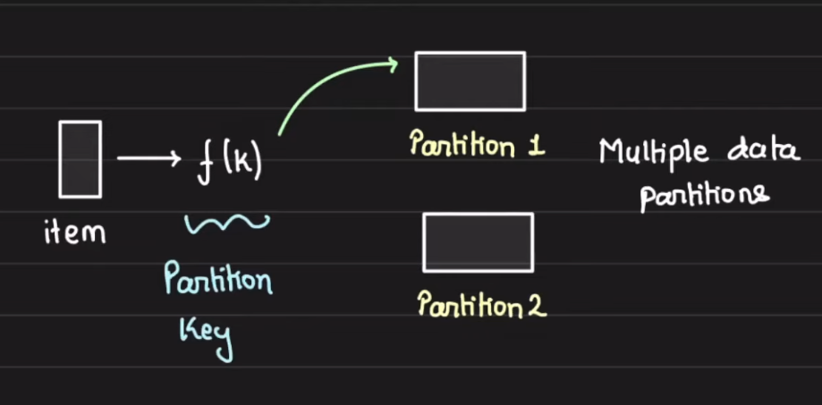
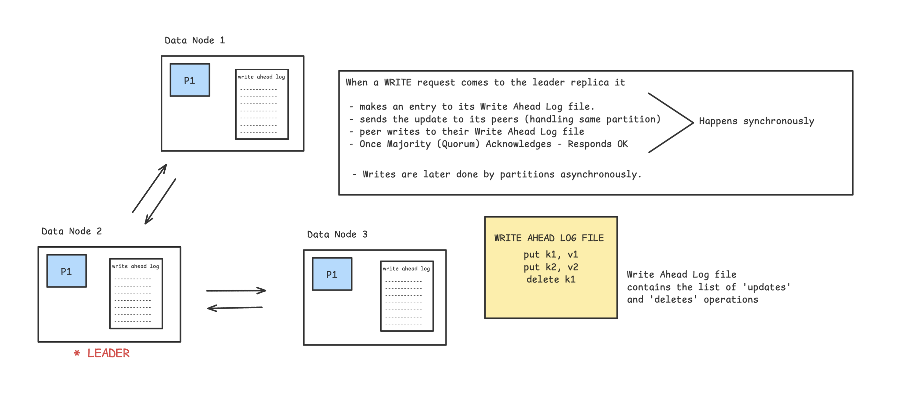

# DynamoDB 

It is a popular Database from AWS providing consistent performance at any scale.

```
In 2021 during 66 hours PRIME DAY SALE

- Trillions of calls to Dynamo DB
- Peak 89.2 Requests / Second
- High Availability with single digit millisecond performance
```


**Goal behind DynamoDB**

to provide consistent performance at any scale with low single digit millisecond latency.

**Workload Pattern**

- Multi Tenant - load of one customer should not affect another customer
- High Resource Utilization - keep infrastructure cost to minimum using resources efficiently
- Boundless Scale of Tables - Tables can scale boundlessly
- Predictable Performance - for any scale of data it should have predictable performance
- Highly Available - replication and recovery
- Flexible Usecase support - schemaless database


**Architecture**

DynamoDB `TABLE` is collection of `ITEMS`.

Each `ITEM` is uniquely identified by its `PRIMARY KEY`

`PRIMARY KEY needs to be specified during table CREATION`


```diff
- PRIMARY KEY can have two parts 
+ PARTITION KEY : required (primary key = partition key only if sort key is not provided)
+ SORT KEY : optional (primary key = partition key  + sort key)
```




DynamoDB also supports `secondary indexes`. Consider Secondary Indexs as tables with two coloumns.

`Indexed Value -> Primary Key` mappings can also be created


Indexed on Age in the table below : 
 
```
10 -> {1} 1 is primary key and 10 is age
10 -> {2}
10 -> {3}

```


DynamoDB Table is divided into `PARTITIONS`. Each Partition is disjoint subset and holds contiguous key-range


Each partition has Multiple Replicas (not read replicas like in mysql) distributed across multiple availability zones. For high availability, the data is made redundant.


```diff
The replicas of a partition for a `REPLICATION GROUP` : 
- one of them is a leader } multipaxos for consensus and leader election
- others are pure replica }

```

Any replica can trigger the Election. When a leader is elected, it can continue to extends its leadership lease*


* this is at PARTITION replica level and not at data node level


**What leader replica does ?**

- Serves Writes
- Serves Strongly consistent reads (because it is serving writes)

DynamoDB supports strongly and eventually consistent reads.

Strong - goes to leader replica
Eventual - goes to any replica    

Reads can be scaled when we can relax consistency.





**Importance of "Partition Abstraction"**


One DynamoDB Table is split 


