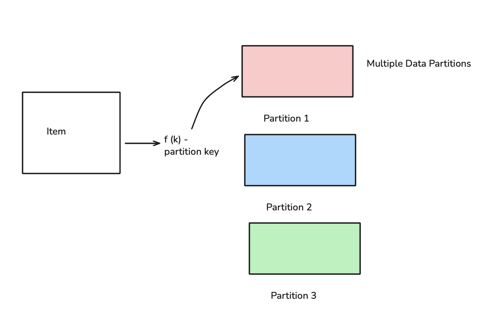
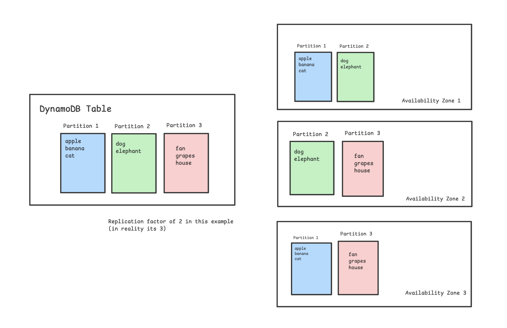
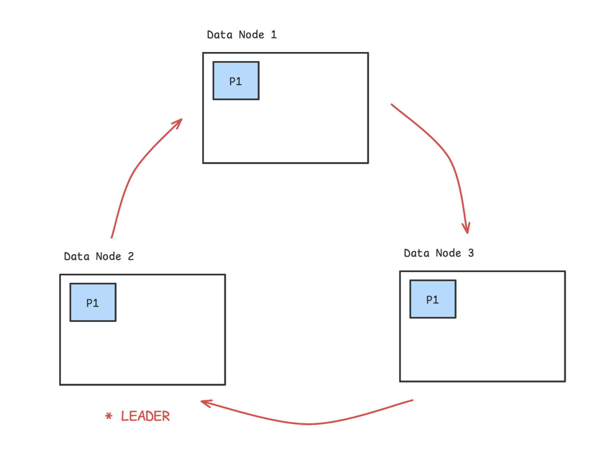
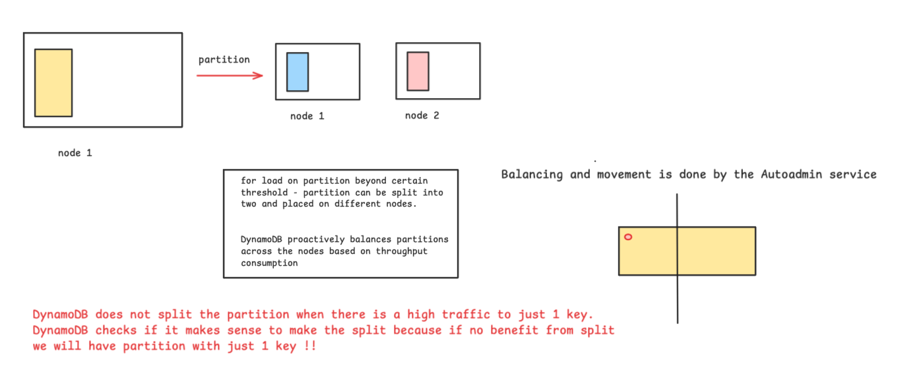
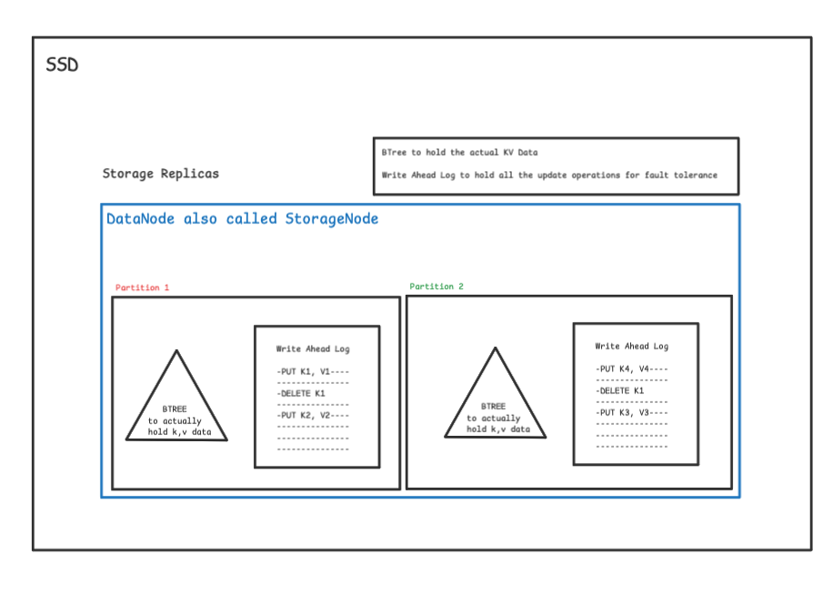
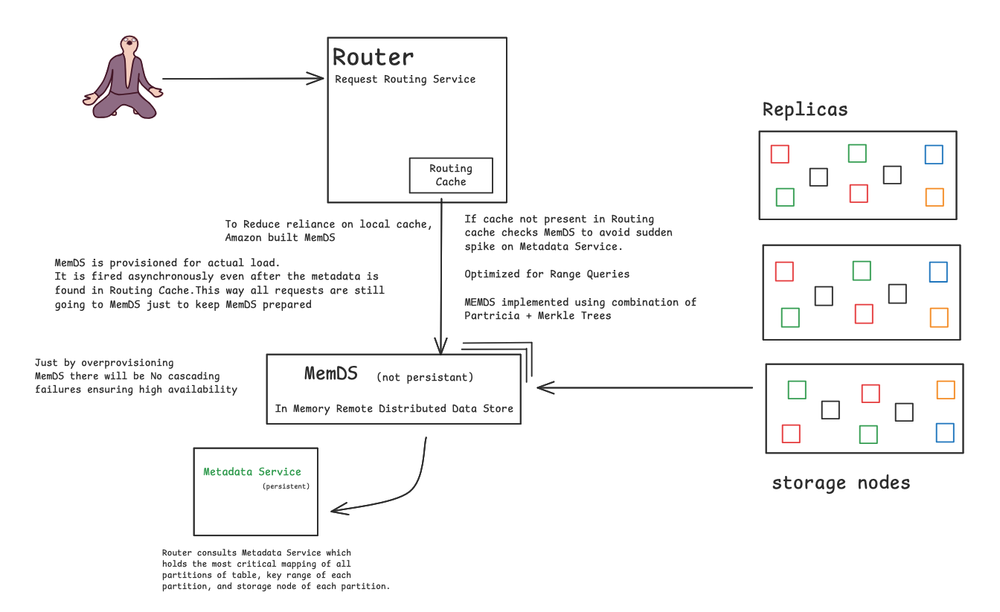
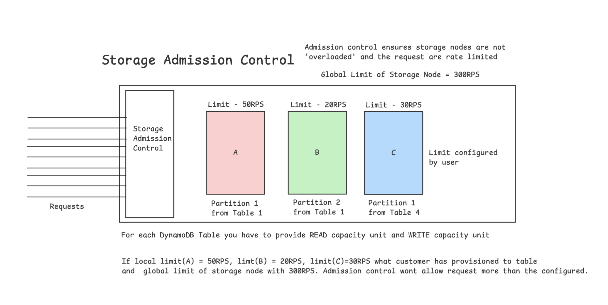
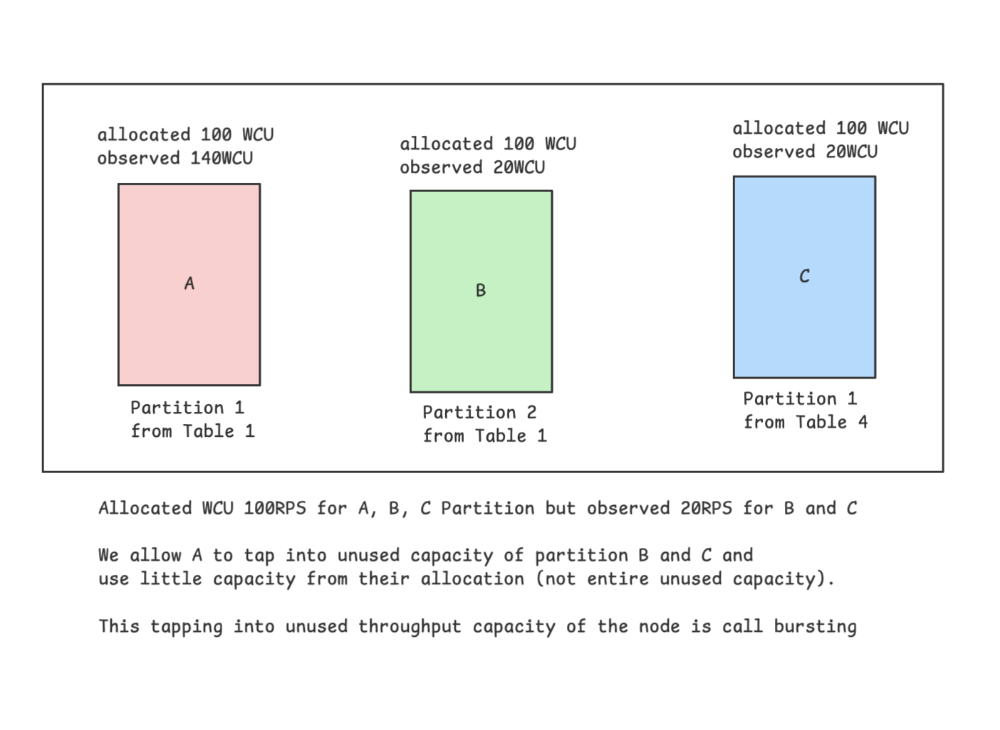
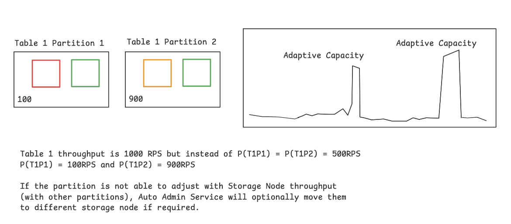
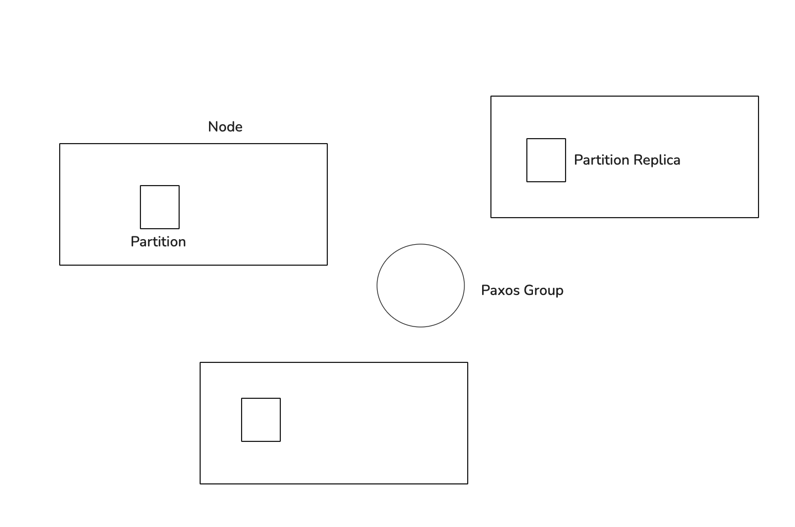

# DynamoDB 

It is a `highly available` `key-value datastore` from AWS providing consistent performance at any scale.

```
In 2021 during 66 hours PRIME DAY SALE

- Trillions of calls to Dynamo DB
- Peak 89.2 Requests / Second
- High Availability with single digit millisecond performance
```

**Goal behind DynamoDB**

To provide consistent performance at any scale with low single digit millisecond latency with high availability and reliability.

**Workload Pattern**

- Multi Tenant - load of one customer should not affect another customer
- High Resource Utilization - keep infrastructure cost to minimum using resources efficiently
- Boundless Scale of Tables - Tables can scale boundlessly
- Predictable Performance - for any scale of data it should have predictable performance
- Highly Available - replication and recovery
- Flexible Usecase support - schemaless database


**Architecture**

DynamoDB `TABLE` is collection of `ITEMS`.

Each `ITEM` is uniquely identified by its `PRIMARY KEY`

`PRIMARY KEY needs to be specified during table CREATION`


```diff
- PRIMARY KEY can have two parts 
+ PARTITION KEY : required (primary key = partition key only if sort key is not provided)
+ SORT KEY : optional (primary key = partition key  + sort key)
```




DynamoDB also supports `secondary indexes`. Consider Secondary index's as tables with two columns.

`Indexed Value -> Primary Key` mappings can also be created. 

Secondary Indexes in DynamoDB allow efficient access to data using attributes other than the primary key, enabling different query patterns.


Indexed on Age in the table below : 
 
```
10 -> {1} 1 is primary key and 10 is age
10 -> {2}
10 -> {3}
```


DynamoDB Table is divided into `PARTITIONS`. Each Partition is disjoint subset and holds contiguous key-range


Each partition has Multiple Replicas (not read replicas like in mysql) distributed across multiple availability zones. For high availability, the data is made redundant.





```diff
The replicas of a partition for a `REPLICATION GROUP` : 
- one of them is a leader } multipaxos for consensus and leader election
- others are pure replica }

```

Any replica can trigger the Election. When a leader is elected, it can continue to extends its leadership lease*


*All this happens at PARTITION replica level and not at data node level.





**What leader replica does ?**

- Serves Writes
- Serves Strongly consistent reads (because it is serving writes)

DynamoDB supports strongly and eventually consistent reads.

Strong - goes to leader replica
Eventual - goes to any replica    

Reads can be scaled when we can relax consistency.


**Importance of "Partition Abstraction"**


One DynamoDB Table is split into partitions and distributed across the cluster.


One table T is split into 3 partitions P1, P2, P3. Each partition is replicated twice across the cluster for High Availibility, Fault Tolerance.


If load on one partition increases beyond certain threshold, ( data within that are updated frequently), it can be split into two and placed on different nodes.





**Storage Replicas**




**Log Replica**

There are some storage replicas that only stores and replicates Write Ahead Logs for High Availability and Fault Tolerance.


**Microservices that makeup DynamoDB**


**Metadata Service**

Stores routing information about tables, indexes and replicas. Metadata Service holds the most critical mapping for all partitions of table, key ranges of each partition, and storage node of each parition.


Router uses metadata service to know where to route the current service
Router downloads routing information locally and keeps it handy. Routing Information rarely changes ( Cache hit 99.75% ) routing info rarely changes.

When Cache is empty, the requests go to metadata service which causes sudden spike.
To reduce reliance on local cache, Amazon build MemDS which is optimized for range queries (less than, greater than and between)


MemDS is implemented using Patricia and Merkle Trees. MemDS distributes
MemDS is provisioned for actual load. It is fired asynchronously even after the metadata is found in Routing Cache. This way all requests are still going to MemDS just to keep MemDS prepared for the load.

MemDS is transient and Metadata Service is persistant. 




**Storage Admission Control**

Admission control ensures storage nodes are not overloaded and requests are rate limited.

One Storage node can host partiions from different tables. Storage node independently performed "Admission control" based on the partitions hosted on it.

Every single thing in the world has its limit. 



Auto Admin Service -  would ensure that one storage node is never assigned partitions whose cumulative limit exceeds 300RPS


DynamoDB users confgured Write Capacity Unit and Read Capacity Unit for a table and this was equally divided across its partitions 


eg : RCU (T1) = 1000 RPS splits in partitions P1 and P2, RCU(P1) 500RPS and RCU(P2) = 500RPS

Now say P2 Splits into P21 and P22

RCU are distributed equally RCU(P1) = 333RPS, RCU(P21) = 333RPS, RCU(P22) = 333RPS

*Assuming all keys are equally likely to be accessed

**BUT WHAT IF THEY ARE NOT !!!***

Say some keys are more likely be accessed / updated. for eq - social media post, new post are more likely to be reacted.


Hot partition now has lesser throughput to work with 

eg P2 had 500RPS, after the split it was reduced to 333RPS in P21 and P22 but after the split customer was expecting 500RPS in both partitions (abstraction over the customer) but spliting the partition _ you just diluted the throughput.


**How to handle throughput dilution ?**


A. Bursting - 

In real world, partitions have non-uniform access so all partions do not use their allocated throughput simultaneously.

Idea : we can let some partition to tap into the unused (only when it is available) throughput capacity of the node.

Unused Capacity = BURST capacity




Implementation for Bursting : 

Each partition on a storage node has two token buckets - allocated and burst.

Each storage node has a token bucket at node level (max throughput)


**B. Adaptive Capacity**

To better absorb long live spikes! -> cannot be handled by burst


eg : skewed workload (partitioned by time and updates & inserts on most recent datetime which will make inserts in most recent partition)

if table experienced throttling but table - level throughput is not exceeded.


Adaptive capacity adjusts the partition throughput in proportion.

Say P(T1) = 1000 and Auto Admin Service optionally moves them to different storage.




Adaptive Capacity is Reactive, It takes time to REACT (to adjust partitioning) meanwhile the tables will have briefly observed unavailability.


**Global Admission Control**

Bursting helps with short lived spikes with Adaptive Capacity is "reactive" thus while its happening, tables have breifly observed unavailability

Key Idea : Centrally track table level throughput consumption.


Request Router maintains local token bucket adn periodically get new from GAC to better handle non uniform workloads.

GAC does not let client breach partition level limits.


**Durability**
 
prevent, detect and correct any possible data losses.


**Hardware Failures**


DynamoDB uses Write Ahead Logs for providing durability and crash recovery.


Write Ahead Logs are periodically archived to S3.


What about logs that are not yet archived to S3 ? 

Note : partitions have replication factor of 3 if a node goes down, a new node is assigned the responsibility. The new node copies BTree and WAL from the other two live replicas.


**Silent Data Errors** 

Any storage layer has to enusre that it NEVER writes any INCORRECT data.

If customer writes "BAT" then "BAT" is what get persisted.

- from customer
- over the network
- into the system
- across the services
- on the disk


DynamoDB uses and verifies "Checksums" at every single data transfer this ensures detection and prevention of silent data errors

Event the log files archived to S3 has checksum check every file has checksum and content metadata file for verification.


Continous verification 


DynamoDB continously verifies data at rest and ensures all 3 (all done through checksums) replicas of partition have exact same data. Live replica data matching with archived on S3 (replicas are constructed from logs).


**Aggressive Testing**

- Stress Testing
- Failure injection testing
- Using formal methods with TLA+ () to test distributed (Transaction and Control Plane) API flow.


**Availability**

DynamoDB tables are replicated across Availability Zones in a region 
Few tests that DDB Team run periodically 

- Resilienc to node, rack aand AZ failures
- Resilancy to power outage
- Resiliancy to data corruption

Availability of partitions

enough healty replicas for write quorum adn a leader

if one partttion replica goes down leader adds a new log (nodt with log only not Btree) replica.





Handling Gray Network Failures

Communication issue b/w leader adn follower of a partition replica


consequence : Replica that interprets connectivity issue as leader outage, will initiage leader Elections (Leader is fit and fine)


Solution : Before initiating leader election, follower iwll talk to other followers to check if then can communicate with leader or not


if some follwers can communicate fowllower aborts leader elction.
This counter checking reduces False positives


**Measuring Availability**

- Regular backend table level monritoring 

- Private canary application in each A2 which makes calls to DDB to measure perceived perfomace adn latencies


Tons of alarms on all the metrics


** External Services**

All the services that YdnamoDb depends on should be more avialable thatn dynamodB

also dynamodb shoudl be able to operate event when some service that id deps on are having an outage


Ex: DynamoDB depends on AWS IAM and AWS KMS 

DynamoDB can operate event when these services are imparied.

DDB Caches the encryption keys and auth tokens 


DDB Periodically refreshes them synchronouly 

if IAM or KMS are down, DDB will still operate till cache expires 


**Deployments**

DynamoDB deploys wihtou a need of any maintainance and with no impact on performance and availability .

New DDB software rollout requires rolling out multiple services autoadmin, router, metadaata etc


**pre requisite of deploying with confidence**

It is about having a strong rollback strategy + canary deploments + automatic rollback ( elevated error rates)

key challenges : Deployments are not atomic


Deployment happended on two out of four but fialed on other two

plus not all deployment can be backward compatible 


eg : new type of message that old code does not understand


**Read Write Deployments**

Instead of deploying all the changes at once split them into read and write changes


1. deply the changes that allows "read" of new type of data
(deploy consumer code first and then producer code).

2. then deploy "write" changes that produces that message