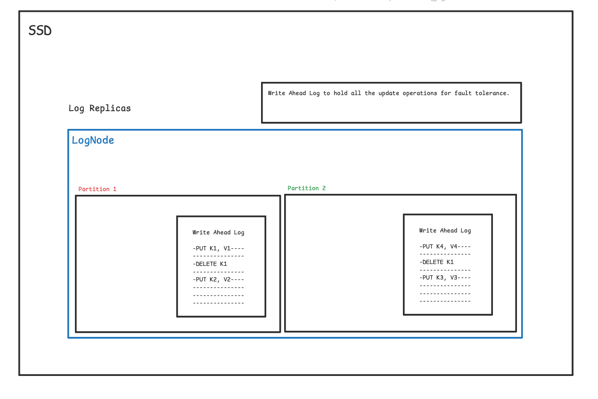

# DynamoDB 

It is a popular Database from AWS providing consistent performance at any scale.

```
In 2021 during 66 hours PRIME DAY SALE

- Trillions of calls to Dynamo DB
- Peak 89.2 Requests / Second
- High Availability with single digit millisecond performance
```


**Goal behind DynamoDB**

to provide consistent performance at any scale with low single digit millisecond latency.

**Workload Pattern**

- Multi Tenant - load of one customer should not affect another customer
- High Resource Utilization - keep infrastructure cost to minimum using resources efficiently
- Boundless Scale of Tables - Tables can scale boundlessly
- Predictable Performance - for any scale of data it should have predictable performance
- Highly Available - replication and recovery
- Flexible Usecase support - schemaless database


**Architecture**

DynamoDB `TABLE` is collection of `ITEMS`.

Each `ITEM` is uniquely identified by its `PRIMARY KEY`

`PRIMARY KEY needs to be specified during table CREATION`


```diff
- PRIMARY KEY can have two parts 
+ PARTITION KEY : required (primary key = partition key only if sort key is not provided)
+ SORT KEY : optional (primary key = partition key  + sort key)
```


DynamoDB also supports `secondary indexes`. Consider Secondary Indexs as tables with two coloumns.

`Indexed Value -> Primary Key` mappings can also be created


Indexed on Age in the table below : 
 
```
10 -> {1} 1 is primary key and 10 is age
10 -> {2}
10 -> {3}

```


DynamoDB Table is divided into `PARTITIONS`. Each Partition is disjoint subset and holds contiguous key-range


Each partition has Multiple Replicas (not read replicas like in mysql) distributed across multiple availability zones. For high availability, the data is made redundant.


```diff
The replicas of a partition for a `REPLICATION GROUP` : 
- one of them is a leader } multipaxos for consensus and leader election
- others are pure replica }

```

Any replica can trigger the Election. When a leader is elected, it can continue to extends its leadership lease*


* this is at PARTITION replica level and not at data node level


**What leader replica does ?**

- Serves Writes
- Serves Strongly consistent reads (because it is serving writes)

DynamoDB supports strongly and eventually consistent reads.

Strong - goes to leader replica
Eventual - goes to any replica    

Reads can be scaled when we can relax consistency.


**Importance of "Partition Abstraction"**


One DynamoDB Table is split into partitions and distributed across the cluster.


One table T is split into 3 partitions P1, P2, P3. Each partition is replicated twice across the cluster for High Availibility, Fault Tolerance


If Load on one partition increases beyond certain threshold, ( docs within that are updated frequently), it can be split into two and placed on different nodes.


**Storage Replicas**


**Log Replica**

There are some storage replicas that only stores and replicates Write Ahead Logs for High Availability and Fault Tolerance.




**Microservices that makeup DynamoDB**


**Metadata Service**

Stores routing information about tables, indexes and replicas. Metadata Service holds the most critical mapping for all partitions of table, key ranges of each partition, and storage node of each parition.


Router uses metadata service to know where to route the current service
Router downloads routing information locally and keeps it handy. Routing Information rarely changes ( Cache hit 99.75% ) routing info rarely changes.

When Cache is empty, the requests go to metadata service which causes sudden spike.
To reduce reliance on local cache, Amazon build MemDS which is optimized for range queries (less than, greater than and between)


MemDS is implemented using Patricia and Merkle Trees. MemDS distributes
MemDS is provisioned for actual load. It is fired asynchronously even after the metadata is found in Routing Cache. This way all requests are still going to MemDS just to keep MemDS prepared for the load.

MemDS is transient hence Metadata Service is Persistant. 


